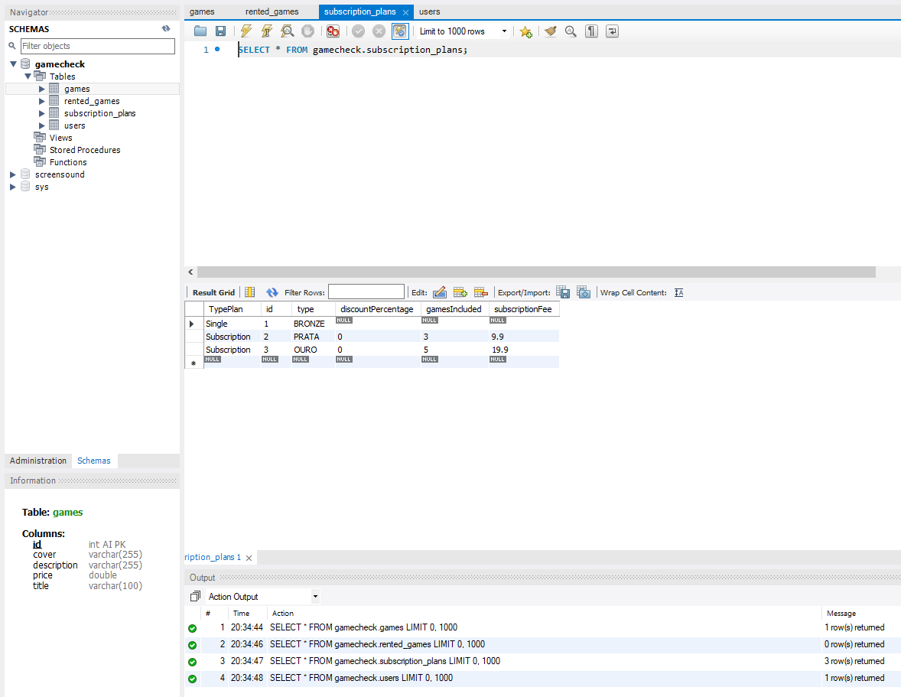

<a name="readme-top"></a>

<!-- PROJECT SHIELDS -->
<!--
*** I'm using markdown "reference style" links for readability.
*** Reference links are enclosed in brackets [ ] instead of parentheses ( ).
*** See the bottom of this document for the declaration of the reference variables
*** for contributors-url, forks-url, etc. This is an optional, concise syntax you may use.
*** https://www.markdownguide.org/basic-syntax/#reference-style-links
-->


<!-- PROJECT LOGO -->
<br />
<div align="center">

<h3 align="center">GameCheck</h3>

  <p align="center">
    A kotlin application that uses Hibernate and implements the technical resoursces learned from <a href="https://cursos.alura.com.br/course/kotlin-persistindo-dados-hibernate">this Alura course.</a>
  </p>
  <p align="center">
    The code is mixed between English and PT-BR considering this is a fork from <a href="https://github.com/alura-cursos/3283-kotlin-alugames-curso3/">this project</a>, so part of the code was already prepared (the part which is in Portuguese).
  </p>
</div>


<!-- TABLE OF CONTENTS -->
<details>
  <summary>Table of Contents</summary>
  <ol>
    <li>
      <a href="#about-the-project">About The Project</a>
    </li>
    <li>
      <a href="#getting-started">Getting Started</a>
      <ul>
        <li><a href="#prerequisites">Prerequisites</a></li>
        <li><a href="#installation">Installation</a></li>
      </ul>
    </li>
    <li><a href="#usage">Usage</a></li>
    <li><a href="#roadmap">Roadmap</a></li>
    <li><a href="#contributing">Contributing</a></li>
    <li><a href="#license">License</a></li>
    <li><a href="#contact">Contact</a></li>
    <li><a href="#acknowledgments">Acknowledgments</a></li>
  </ol>
</details>


<!-- ABOUT THE PROJECT -->
## About The Project

[![MIT License][license-shield]][license-url]
[![LinkedIn][linkedin-shield]][linkedin-url]
[](https://www.bing.com/search?q=kotlin+docs&cvid=09bf36b937384482bb11751d2fbd9c1a&gs_lcrp=EgZjaHJvbWUyBggAEEUYOTIGCAEQRRg8MgYIAhBFGDwyBggDEEUYQTIGCAQQRRhBMgYIBRBFGEEyCAgGEOkHGPxV0gEIMTEzN2owajmoAgCwAgE&FORM=ANAB01&PC=U531)


The project is capable of doing ADD, DELETE and GET operations from a MySQL locally created or remote, based on a game renting model.

<p align="right">(<a href="#readme-top">back to top</a>)</p>

<!-- GETTING STARTED -->
## Getting Started

It is a simple project to run and all you gotta do is quick configure a MySQL Database locally (or remote), create the persistence configuration file, compile it using any given tool (although I do recommend IntelliJ), run it and be happy testing!!

### Prerequisites

* JavaJDK
* IntelliJ
* MySQL Workbench / MySQL

### Installation

1. Clone the repo
   ```sh
   git clone https://github.com/P-py/GameCheckgit
   ```
3. Get a free installation of MySQL and do the base configuration @ [MySQL](https://www.mysql.com/) - Keep in mind it is **ESSENCIAL for you to rememeber the password for the MySQL root user**.
4. Open the MySQL instance like shown below and execute the queries to create the test database

   ```sql
   CREATE DATABASE gamecheck; 
   CREATE TABLE games(id INT AUTO_INCREMENT PRIMARY KEY, cover VARCHAR(255), description VARCHAR(255), price DOUBLE, title VARCHAR(100));
   CREATE TABLE rented_games(id INT AUTO_INCREMENT PRIMARY KEY);
   CREATE TABLE subscription_plans(id INT AUTO_INCREMENT PRIMARY KEY, type VARCHAR(255), discountPercentage DOUBLE, gamesIncluded INT, subscriptionFee DOUBLE);
   CREATE TABLE users(id INT AUTO_INCREMENT PRIMARY KEY, name VARCHAR(100), email VARCHAR(255), birthDate VARCHAR(15), user VARCHAR(100));
   ```
5. **CREATE** the `persistence.mxl` under the `Gamecheck/src/main/resources/META-INF/` folder and copy the hibernate config file below, where you **should edit the field `javax.persistence.jdbc.password`**.
    ```xml
    <?xml version="1.0" encoding="UTF-8"?>
    <persistence version="2.2" xmlns="http://xmlns.jcp.org/xml/ns/persistence"
                xmlns:xsi="http://www.w3.org/2001/XMLSchema-instance"
                xsi:schemaLocation="http://xmlns.jcp.org/xml/ns/persistence http://xmlns.jcp.org/xml/ns/persistence/persistence_2_2.xsd">
        <persistence-unit name="gamecheck" transaction-type="RESOURCE_LOCAL">
            <properties>
                <property name="javax.persistence.jdbc.driver" value="com.mysql.cj.jdbc.Driver"/>
                <property name="javax.persistence.jdbc.url" value="jdbc:mysql://localhost:3306/gamecheck"/>
                <property name="javax.persistence.jdbc.user" value="root"/>
                <property name="javax.persistence.jdbc.password" value="###"/>
                <property name="hibernate.dialect" value="org.hibernate.dialect.MySQL8Dialect"/>
                <property name="hibernate.hbm2ddl.auto" value="update"/>
                <property name="hibernate.show_sql" value="true"/>
                <property name="hibernate.format_sql" value="true"/>
            </properties>
        </persistence-unit>
    </persistence>
    ```
6. Run `Main.kt` on intelliJ or other favorite console/IDE

<p align="right">(<a href="#readme-top">back to top</a>)</p>


<!-- USAGE EXAMPLES -->
## Usage

After running the [Main.kt](./src/main/kotlin/com/local/gamecheck/main/Main.kt) file you should be able to see this on the intelliJ console (or other console.)


With this menu you can execute all the operations on the MySQL database created before, validating the normal work of Hibernate + JPA implementation. Going further you can also check the database structure and alterations with MySQL Workbench.



<p align="right">(<a href="#readme-top">back to top</a>)</p>


<!-- ROADMAP -->
## Roadmap

### TO-DO / NOT AVALIABLE YET

<p align="right">(<a href="#readme-top">back to top</a>)</p>


<!-- CONTRIBUTING -->
## Contributing

Contributions are essential in the tech world, especially for beginners like me, they are what makes the open-source and dev world such an amazing place to learn and create. Any contributions you make are **appreciated**.

If you have a suggestion that would make this better, please fork the repo and create a pull request. Please give the project a star!

1. Fork the Project
2. Create your Feature Branch (`git checkout -b feature/AmazingFeature`)
3. Commit your Changes (`git commit -m 'Add some AmazingFeature'`)
4. Push to the Branch (`git push origin feature/AmazingFeature`)
5. Open a Pull Request

<p align="right">(<a href="#readme-top">back to top</a>)</p>


<!-- LICENSE -->
## License

Distributed under the MIT License. See `LICENSE.txt` for more information.

<p align="right">(<a href="#readme-top">back to top</a>)</p>


<!-- CONTACT -->
## Contact

Pedro Santos - pedrosalviano170@gmail.com

Project Link: [https://github.com/P-py/CineSearch](https://github.com/P-py/CineSearch)

<p align="right">(<a href="#readme-top">back to top</a>)</p>


<!-- ACKNOWLEDGMENTS -->
## Acknowledgments

### TO-DO / NOT AVALIABLE YET

<p align="right">(<a href="#readme-top">back to top</a>)</p>


<!-- MARKDOWN LINKS & IMAGES -->
<!-- https://www.markdownguide.org/basic-syntax/#reference-style-links -->
[license-shield]: https://img.shields.io/github/license/P-py/CineSearch.svg?style=for-the-badge
[license-url]: https://github.com/P-py/CineSearch/blob/master/LICENSE.txt
[linkedin-shield]: https://img.shields.io/badge/-LinkedIn-black.svg?style=for-the-badge&logo=linkedin&colorB=555
[linkedin-url]: https://linkedin.com/in/linkedin_username
[product-screenshot]: README_files/demo.png
[database-config]: README_files/database-config.png
